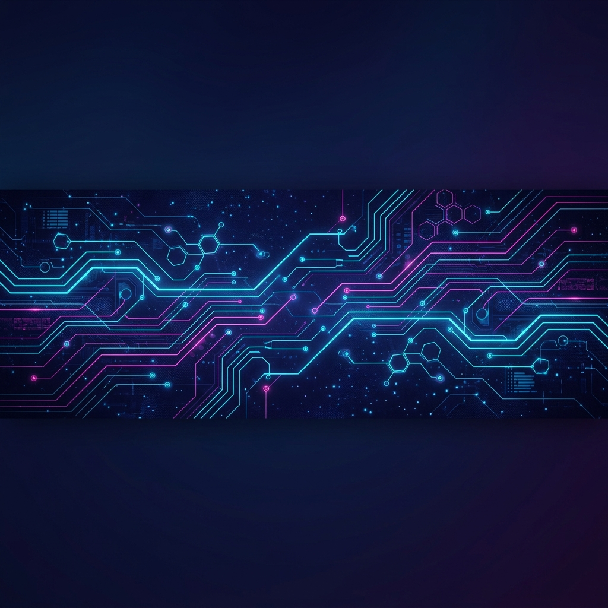

  <!-- Premium IA-Generated Banner -->
  
  
   
  
  <!-- Subtitle Typing Animation -->
  

  <!-- Social Connections -->
  

    
    
    
  

 

<!-- Main Grid Container -->
<table border="0" width="100%" cellpadding="10" cellspacing="0">
  <tr>
    <!-- Left Column: About and Tech Stack -->
    <td width="55%" valign="top">
      
      <h3>🚀 Sobre Mim | About Me</h3>
      

        Estudante de <b>Sistemas de Informação na PUCRS</b>, apaixonado por arquitetura de software e sistemas de alta performance. Atualmente focado no desenvolvimento de soluções escaláveis e resilientes usando <b>Java (Spring Boot)</b> e <b>Node.js</b>.
      

      
      <ul>
        <li>🔭 Desenvolvendo sistemas corporativos e soluções focadas em LegalTech.</li>
        <li>🌱 Aprofundando em <b>Microserviços</b>, <b>Cloud Native</b> e padrões de alta escalabilidade.</li>
        <li>🔒 Foco em <b>Segurança da Informação</b> e aplicação de <b>Arquitetura Limpa (Clean Architecture)</b>.</li>
        <li>📍 Gramado, Rio Grande do Sul, Brasil.</li>
      </ul>
      
       
      
      <h3>🛠️ Minhas Tecnologias | Tech Stack</h3>
      
      <table>
        <tr>
          <td>
            <b>Core & Back-End:</b> 
            
          </td>
        </tr>
        <tr>
          <td>
            <b>Front-End & Mobile:</b> 
            
          </td>
        </tr>
        <tr>
          <td>
            <b>DevOps & Tools:</b> 
            
          </td>
        </tr>
      </table>
      
    </td>
    
    <!-- Right Column: GitHub Statistics -->
    <td width="45%" valign="top" align="center">
      
      <h3>📊 Estatísticas | GitHub Stats</h3>
      
      <!-- Streak Stats Card -->
      
      
        
      
      <!-- Main Stats Card -->
      
      
        
      
      <!-- Top Languages Card -->
      
      
    </td>
  </tr>
</table>

 

<!-- Contribution Snake Game -->
<h3 align="center">🐍 Atividade de Contribuição | Contribution activity</h3>

  <i>🐍 A animação da cobrinha iniciará após o seu commit inicial!</i>
    
  

 

<!-- Footer waving layout -->

  

