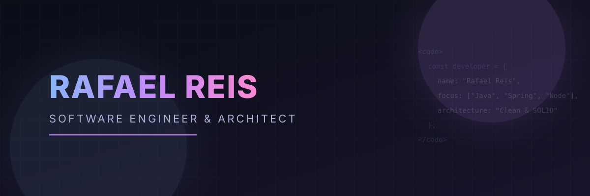

  <!-- Custom SVG Banner -->
  

    

  <!-- Subtitle Typing Animation -->
  

  <!-- Social Connections -->
  

    
    
    
  

  <!-- Professional Status Badges -->
  

    
    
    
  

---

## 🚀 Sobre Mim | About Me

Estudante de **Sistemas de Informação na PUCRS**, apaixonado por **Arquitetura de Software** e desenvolvimento de **Sistemas de Alta Performance**. Focado na construção de soluções escaláveis, resilientes e seguras aplicando princípios de **Clean Architecture**, **SOLID**, **DDD** e ecossistema **Cloud Native**.

- 🔭 **Atualmente:** Desenvolvendo sistemas corporativos e soluções focadas em **LegalTech**.
- 🌱 **Evoluindo em:** Microsserviços com **Java (Spring Boot)**, **Node.js**, **Docker** e alta escalabilidade.
- 🔒 **Engenharia & Qualidade:** Aplicação rigorosa de **Clean Code**, **Segurança da Informação** e testes automatizados.
- 📍 Gramado, Rio Grande do Sul, Brasil.

---

## 🎯 Focos e Objetivos | Core Focus
* **⚡ Performance:** Otimização de sistemas e algoritmos de alto rendimento.
* **🏗️ Arquitetura:** Construção de sistemas desacoplados, limpos e de fácil manutenção (Clean Architecture).
* **☁️ Escalabilidade:** Integração contínua, Docker e microsserviços resilientes.

---

## 📌 Repositórios em Destaque | Featured Projects

### 🔒 [Projeto-TenantCore](https://github.com/RafaelReis22/Projeto-TenantCore)
> Infraestrutura de segurança distribuída projetada para aplicações SaaS modernas que exigem isolamento crítico de dados multi-tenant.
- **Tech Stack:** `Java` `Security` `Clean Architecture` `SaaS`

### ⚡ [ACMEVoting](https://github.com/RafaelReis22/ACMEVoting)
> Reconstrução de alta performance e rigor arquitetural do sistema de votação ACME Voting, com foco em SOLID e complexidade algorítmica O(1).
- **Tech Stack:** `Java` `High Performance` `Algorithms` `Clean Code`

### 🎬 [ACMEFilmes (CinePro)](https://github.com/RafaelReis22/ACMEFilmes)
> Plataforma CinePro para processamento e gestão de acervos audiovisuais, transformando catálogos em relatórios estatísticos e analíticos.
- **Tech Stack:** `Java` `Data Processing` `Analytics` `Software Engineering`

### 🚗 [Carros](https://github.com/RafaelReis22/Carros)
> Sistema de simulação de veículos de alto desempenho construído com princípios de Arquitetura Limpa e SOLID.
- **Tech Stack:** `Java` `Simulation` `Clean Architecture`

---

## 🛠️ Minhas Tecnologias | Tech Stack

### 💻 Back-End & Core

### 🎨 Front-End & Mobile

### 🔧 DevOps & Tools

---

## 📊 Estatísticas do GitHub | GitHub Stats

  

    
    
  

   

  <!-- Streak Stats Card -->
  

    

  <!-- Activity Graph -->
  

---

## 🐍 Atividade de Contribuição | Contribution Activity

  

 

<!-- Footer waving layout matching Tokyo Night theme -->

  

